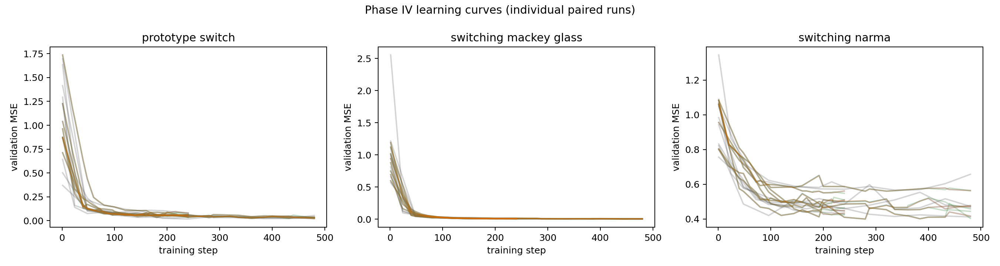
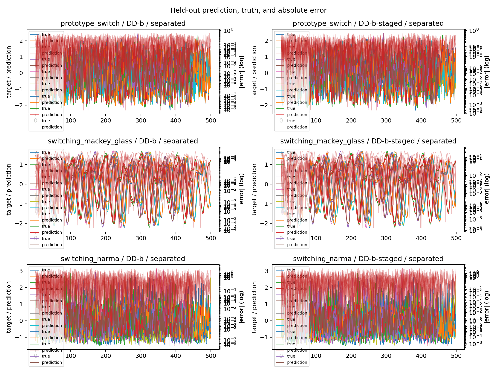
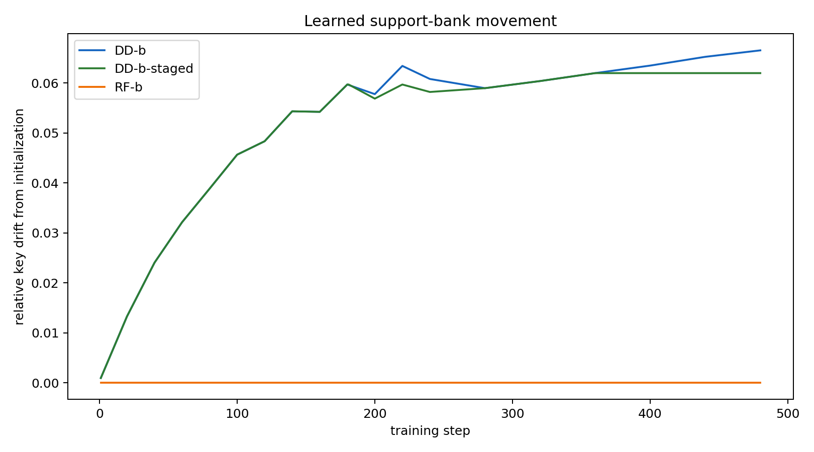

# Phase IV Factorial Mechanism Screen

**Status:** 96 completed runs, 0 failed runs.

## Technical summary

This is a bounded Stage B development screen, not a confirmatory result. It tests whether currently supported learned-memory controls change with a small set of reproducible recurrence, coefficient-separation, and delay-separation conditions. Positive improvement means lower held-out test MSE than the paired D0 control.

Expected manifest rows: `96`; observed metric rows: `96`; failed rows: `0`.

## Largest descriptive effects

- `prototype_switch` / `recurring` / `M` / `RF-b`: 46.50% relative test improvement vs D0 (n=2).
- `prototype_switch` / `recurring` / `M` / `DD-b`: 46.44% relative test improvement vs D0 (n=2).
- `prototype_switch` / `recurring` / `M` / `DD-b-staged`: 40.91% relative test improvement vs D0 (n=2).
- `switching_mackey_glass` / `recurring` / `S` / `DD-b-staged`: 28.61% relative test improvement vs D0 (n=2).
- `switching_mackey_glass` / `recurring` / `S` / `DD-b`: 24.90% relative test improvement vs D0 (n=2).
- `switching_mackey_glass` / `recurring` / `S` / `RF-b`: 24.34% relative test improvement vs D0 (n=2).
- `switching_mackey_glass` / `separated` / `M` / `DD-b-staged`: 21.41% relative test improvement vs D0 (n=2).
- `switching_mackey_glass` / `recurring` / `M` / `DD-b`: 12.35% relative test improvement vs D0 (n=2).

These are descriptive paired summaries with two seeds per cell. They do not establish a causal mechanism, generalize to untested factors, or justify a confirmatory decision.

## Visual evidence

## Scope and metric definitions

- `D0` is the no-persistent-memory baseline; `DD-b` is the jointly trained learned bank; `DD-b-staged` is the existing warmup-then-freeze proxy for `DD-KV75`; `RF-b` is a frozen random-bank control.
- Test checkpoints are selected using validation loss only. Test MSE is reported after selection and is not used for training or checkpoint choice.
- The `recurring` and `separated` conditions are task-specific controls defined in `kam/phase4/manifest.py`; they are not yet the full factor library specified for Phase IV.

## Limitations and next steps

1. Add the missing controlled generators and freeze policies from the authoritative Phase IV brief, especially full-path freezing, drift-triggered freezing, noise-type controls, observability, and symbolic regimes.
2. Expand the screen only after checking the paired effects and resource profile here.
3. Promote no condition to confirmation without new seeds, held-out schedules/streams, registered endpoints, and paired uncertainty intervals.

## Reproducibility

- Manifest: `results/phase4/manifests/factorial_screen.jsonl`
- Raw runs: `results/phase4/factorial_screen/runs/`
- Aggregated metrics: `results/phase4/factorial_screen/all_metrics.csv` and `summary.csv`
- Figures: `reports/phase4/figures/`
- Execution: `scripts/submit_phase4_hpg.sh --submit`

